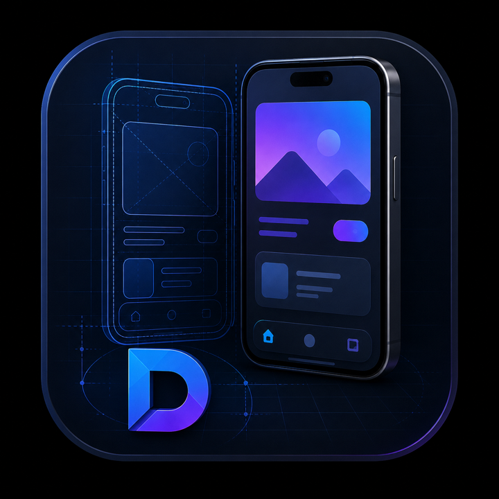

<div align="center">
  
  <h1>Diorama</h1>
  <p><b>Run your Compose app inside a simulated device and swap the hardware live. One real phone is enough.</b></p>
</div>

A diorama is a scale model of a scene built to be looked at, which is what this is: a miniature,
faithful model of a device holding your actual, interactive app. Inspired by Flutter's
[`device_preview`](https://pub.dev/packages/device_preview).

```kotlin
setContent {
  Diorama {
    MyApp()
  }
}
```

Wrap your root, run on any device, and a panel lets you change the simulated device, orientation,
font scale and dark mode while the app keeps running and keeps its state.

> Status: early skeleton. The override engine and the scaling primitive are real and verified; the
> device catalog and the bezel art are placeholders. See [Roadmap](#roadmap).

## Why this exists

Nothing in the Compose ecosystem does this today. Android Studio's `@Preview` is design-time and
per-composable. Showkase and Composium are component browsers, not app wrappers. Paparazzi and
Roborazzi render off-device for snapshot tests. Every commercial option is a cloud device farm or a
CI visual-diff. `PreviewActivity` deploys one composable and
[ignores every `@Preview` parameter](https://developer.android.com/develop/ui/compose/tooling/previews).

The load-bearing half, a configuration-override engine that is *correct*, already exists as
`androidx.compose.ui.test.DeviceConfigurationOverride`. Nobody had connected it to a runtime panel.

## Architecture

Two modules, split on the same seam Flutter's `device_preview` / `device_frame` got right:

| Module | Targets | Holds |
|---|---|---|
| `:diorama-frame` | android, jvm, iosArm64, iosSimulatorArm64 | Device model, catalog, bezel, the scaling primitive. Never touches `Context`. |
| `:diorama` | android | The configuration-override engine, the panel, state. |

### The two halves must stay separate

The app is **constrained** to the device's logical size (`Constraints.fixed`) and only ever
**scaled visually** (`placeWithLayer`). Never scale to constrain: that produces an app that
reports one size and lays out at another.

`placeWithLayer` is load-bearing rather than stylistic: it creates a real `OwnedLayer`, so
`NodeCoordinator` hit-tests through the inverse matrix and pointer input maps correctly with no
manual transform. The same scale drawn via `Canvas.scale`/`drawWithContent` has no layer, so the
pixels move and the touch targets stay behind.

Keeping `CompositingStrategy.Auto` and `alpha = 1f` is what keeps text crisp: `RenderNode`
transforms without re-recording the display list, so glyphs re-rasterize at the final scaled size.
Anything that forces an offscreen buffer rasterizes at natural size and bilinear-filters it.

### Why the engine is vendored, not depended on

`DeviceConfigurationOverride` lives in `androidx.compose.ui:ui-test`. Depending on it drags Espresso,
the test runner and Hamcrest into the build, and Google documents it as a test-only API. Vendoring
(~120 lines, Apache-2.0, attributed in `ConfigurationOverride.kt`) also allows two fixes:

Upstream allocates a fresh `ContextThemeWrapper` **and** a fresh `FontFamilyResolver` on every
recomposition. `Configuration` is a mutable Java class and therefore unstable, so the composable can
never skip; `LocalContext` is a *static* CompositionLocal, so a new Context identity invalidates the
whole subtree unconditionally. That is invisible in a test that composes once. Behind a slider it
recomposes the entire app, with a cold font cache, every frame. `remember(configuration)` fixes it,
and is also mandatory for correctness: `ContextThemeWrapper` throws if `applyOverrideConfiguration`
is called twice on one instance.

### Why `WindowSize`, not `ForcedSize`

`ForcedSize` does not scale anything. It *lowers the density* until the requested dp count fits the
real pixels, deriving density from a fit ratio it computes itself. Measured on a Pixel emulator
(1280×2856px, 427×952dp, 480dpi), simulating a 1280×800 tablet:

| | `windowSizeClass` | `containerSize` | `screenWidthDp` | `densityDpi` |
|---|---|---|---|---|
| baseline (host) | minW=0 | 1280×2856 | 427 | 480 |
| `ForcedSize` | minW=840, minH=900 *(wrong)* | 1280×2856 *(host's)* | 427 *(host's)* | 159 *(wrong)* |
| `WindowSize` | minW=840, minH=480 | 1272×795 | 1280 | 159 *(wrong)* |
| Diorama | minW=840, minH=480 | 1920×1200 | 1280 | 240 |

The device is a 1280×800 tablet at 240dpi. Only the last row reports it.

`ForcedSize` leaves `screenWidthDp` at the host's value and only appears to work: its size class
flips because density collapsed, and its *height* class comes out wrong (900 for a device 800dp
tall). Worse, the derived density depends on the size of the container you put the override in. The
159 above is `3.0 × (424/1280)`, where 424 is the width of the box, not a property of the device.
Change the panel width and the simulated device's dpi moves.

Diorama sets `Configuration.densityDpi = spec.dpi` explicitly and does the visual scaling itself, so
a 1280×800 tablet reports **240dpi** and resolves resources in the right bucket.

### Every axis is set explicitly

`Configuration.updateFrom` merges onto the host, so anything left alone inherits it silently. The
emulator above has a 2× accessibility font scale, and both `ForcedSize` and `WindowSize` leak it
straight into the simulation. `DioramaState.fontScale` defaults to `1f` for that reason.

## What it cannot do

- **Fold / posture.** `calculatePosture()` reads `WindowInfoTracker.getOrCreate(context)`, which
  unwraps to the real Activity, so an overridden Context does not fool it. The only lever is
  `WindowInfoTracker.overrideDecorator()`, which is `@RestrictTo(LIBRARY_GROUP)` and process-global.
  Window *size class* simulates correctly; posture does not.
- **Anything native.** It is a composable in your process on your host OS. Fonts, rasterization and
  performance are the host's.
- **Real dpi rendering.** The reported dpi drives resource-bucket selection, but pixels are drawn at
  the host's density and resampled.
- **Global coordinates.** `positionInWindow()` returns host-window coordinates while the simulated
  size says otherwise. Every dropdown/dialog/popup bug in device_preview's tracker is this, and the
  hazard ports over intact.

## Roadmap

- **Device catalog**. Currently Android Studio's four reference specs, the only upstream device
  definitions that are both authoritative and self-contained. Import real hardware from
  `com.android.tools:sdklib` (Apache-2.0). Two gaps it won't fill: roundness/chin, and `cutout`,
  which exists only in Studio's DeviceSpec layer and not the AOSP schema. Do **not** port
  device_preview's catalog: its iPhone 12 carries an iPad Pro screen size.
- **Bezels**. Placeholder rounded rect. Real frames need the numeric safe areas and the screen path
  derived from one another, shipped as SVG path data through `PathParser`.
- **Simulated insets / notch**. The preview chrome keeps clear of the *host's* safe area, but the
  app inside the frame still reads the host's insets rather than the simulated device's. There is
  no insets CompositionLocal; they resolve `LocalView` → `WeakHashMap<View, WindowInsetsHolder>`,
  so the only route is a nested `AndroidView` intercepting `dispatchApplyWindowInsets`, which must
  wrap the configuration override since a new Owner re-provides `LocalDensity`. API 29+ for
  cutouts, 30+ for per-type; below that it silently no-ops. `WindowInsetsHolder` also erases insets
  for hardware the host lacks, and its `setUseTestInsets` escape hatch is `internal`.
- **Locale**. Needs its own plumbing; upstream's `LocalProvidableLocaleList` is `@VisibleForTests`.
- **Persistence**. DataStore, written from `snapshotFlow { }.debounce(500)`.
- **Tools API**. `tools: List<DioramaTool>` composed into the panel, screenshot capture first
  (`rememberGraphicsLayer()` + `toImageBitmap()`).
- **Other platforms**. `:diorama-frame` is already portable. `:diorama` needs an expect/actual seam;
  density, layout direction and window size are expressible everywhere, only the
  Context/Configuration half is Android-specific.

## License

MIT, except `diorama/src/androidMain/kotlin/dev/lutero/diorama/ConfigurationOverride.kt`, which is
derived from the Android Open Source Project and stays under Apache-2.0 with its original header.
